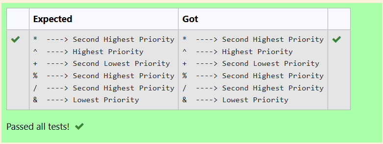

# EX 1A Display operator precedence in the infix expression.
## DATE: 21/02/2025
## AIM:
To write a C program to find and display the priority of the operator in the given Postfix expression

## Algorithm
1. Start the program.
2. Include the required libraries
3. Define a function to display the priority of the operator in a postfix expression.
4. Use if-else statements to specify the priority and return it.
5. End the program.

## Program:
```
/*
Program to find and display the priority of the operator in the given Postfix expression
Developed by: MARIO VIOFER J
RegisterNumber: 212223100032
*/

#include <stdio.h>
#include<string.h>

    int priority(char x)
{
   if(x=='^')
   return 1;
   if(x=='*'||x=='%'||x=='/')
   return 2;
   if(x=='+'||x=='-')
   return 3;
   if(x=='&')
   return 4;
   else
   return 0;
}
int main()
{
   int i,j;
   char x;
   char ch[100]="(A*B)^C+(D%H)/F&G";
   for(i=0;i<strlen(ch);i++)
   {
       for(j=0;j<strlen(ch);j++)
       {
           if(ch[i]=='^'||ch[i]=='*'||ch[i]=='%'||ch[i]=='/'||ch[i]=='+'||ch[i]=='-'||ch[i]=='&')
       {
           x=ch[i];
           if(priority(x)==1)
           {
               printf("%c  ----> Highest Priority\n",x);
               break;
           }
           if(priority(x)==2)
           {
               printf("%c  ----> Second Highest Priority\n",x);
               break;
           }
           if(priority(x)==3)
           {
              printf("%c  ----> Second Lowest Priority\n",x);
              break;
           }
           if(priority(x)==4)
           {
             printf("%c  ----> Lowest Priority\n",x);
             break;
           }
       } 
       }
   }
    return 0;
}
   
```

## Output:



## Result:
Thus the C program to find and display the priority of the operator in the given Postfix expression is implemented successfully
