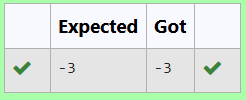

# Ex 1D Evaluation of prefix expression
## DATE: 26/02/2025
## AIM:
To write a C function to evaluate the given prefix expression using stack and print the output of the given prefix expression from the stack inside the function . 

## Algorithm
1. Start
2. Initialize an empty stack s with a variable top for tracking the stack index.
3. Define a push() function to add an element to the stack.
4. Define a pop() function to remove and return the top element from the stack.
5. In evalprefix(), loop through the given prefix expression from right to left.
6. For each character, if it’s an operator (+, *), pop two operands from the stack, perform the 
operation, and push the result.
7. If it's a digit, convert it to an integer and push it onto the stack; finally, print the result after 
the loop ends.
8. End


## Program:
```
/*
Program to evaluate the given prefix expression
Developed by: MARIO VIOFER J
RegisterNumber: 212223100032
*/

#include<stdio.h>
#include<string.h>
#include<ctype.h>

int s[50];
int top=0;

void push(int ch)
{
	top++;
	s[top]=ch;
}

int pop()
{
	int ch;
	ch=s[top];
	top=top-1;
	return(ch);
}

void evalprefix(char p[50])
{
    int n1,n2,res,i;
    for(i=strlen(p)-1;i>=0;i--)
    {
        if(isdigit(p[i]))
        push(p[i]);
        else 
        {
            n1=pop();
            n2=pop();
            if(p[i]=='-')
            res=n1-n2;
            else if(p[i]=='*')
            res=n1*n2;
            push(res);
        }
    }
    printf("%d",pop());
}


```

## Output:



## Result:
Thus, the C program to evaluate the prefix expression using stack and print the output of the given prefix expression from the stack inside the function is implemented successfully.
